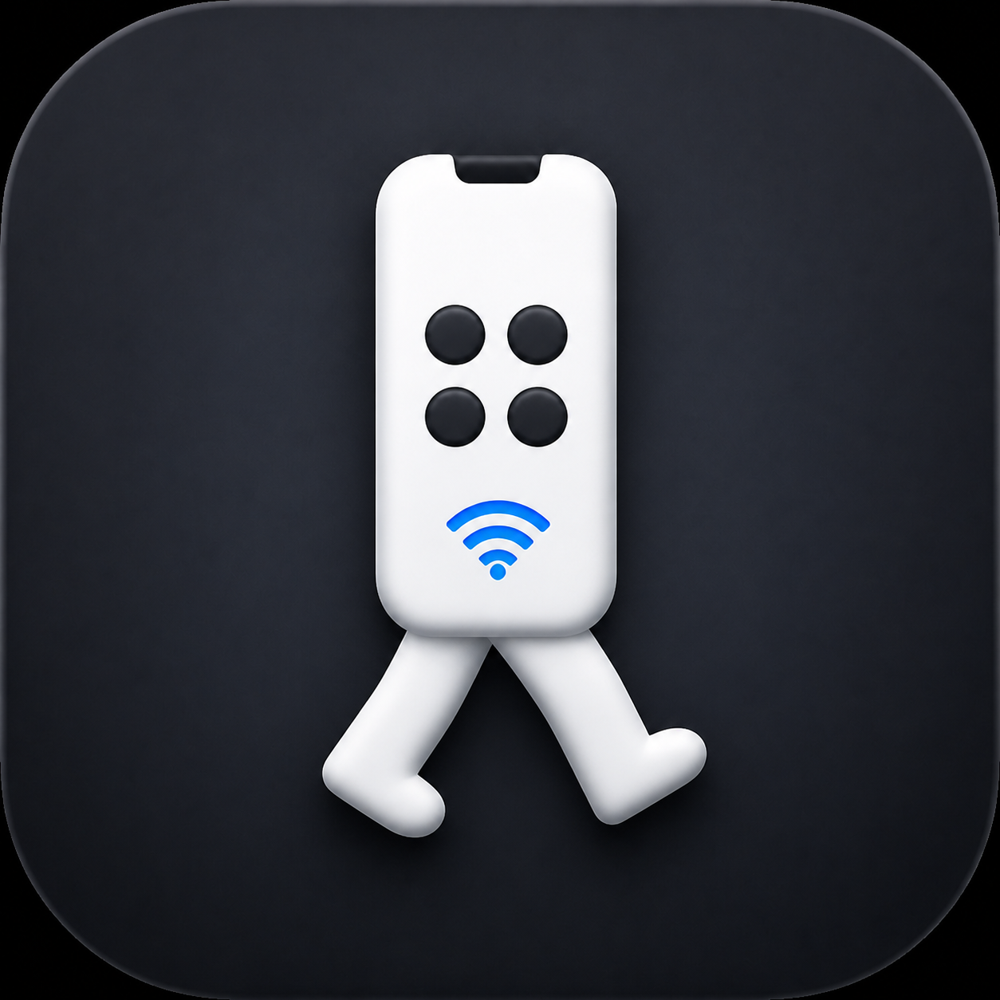
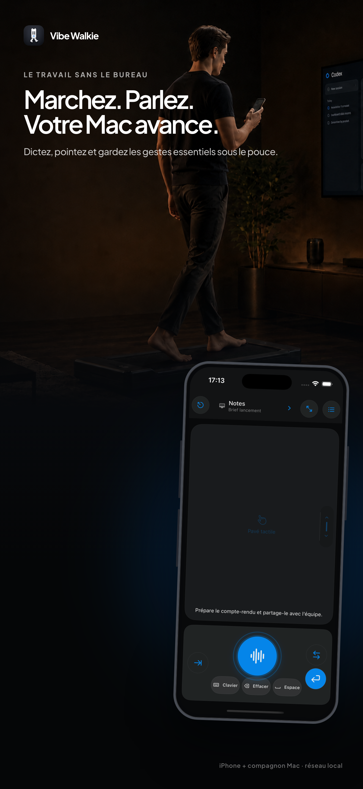
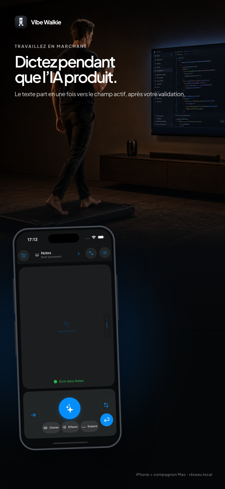
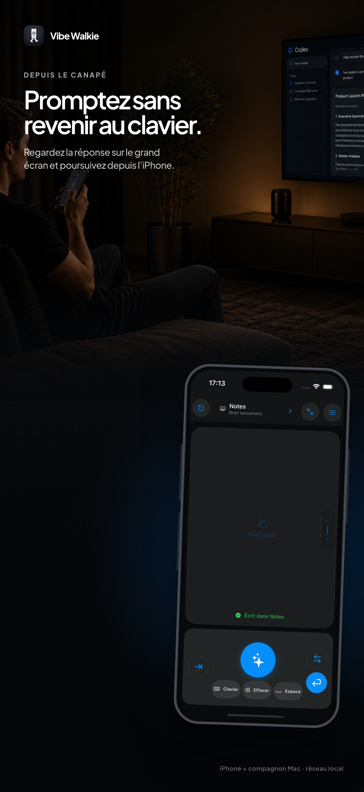
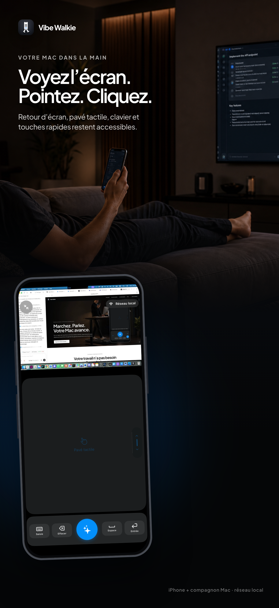
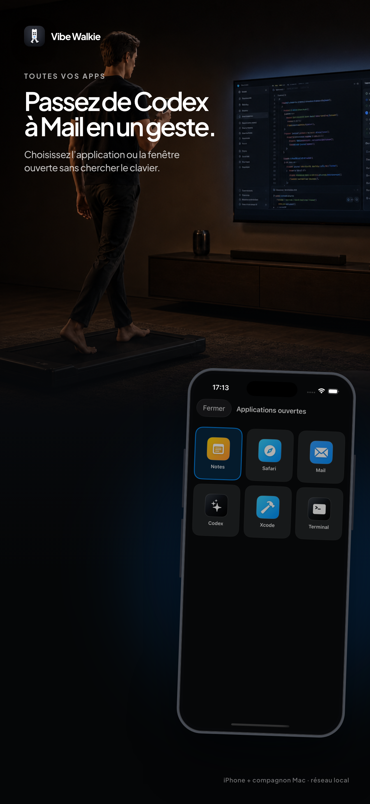
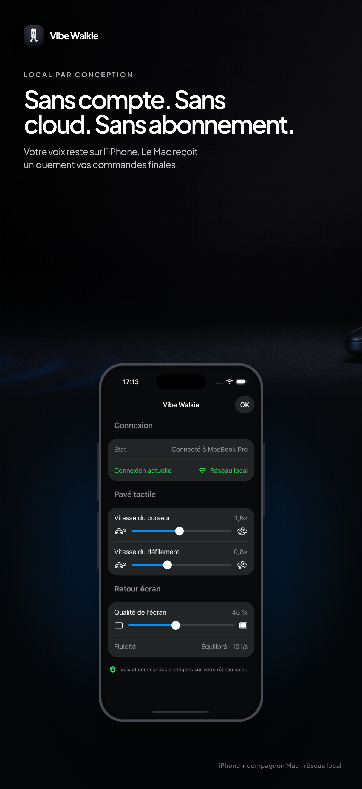

<p align="center">
  
</p>

<h1 align="center">Vibe Walkie</h1>

<p align="center">
  <strong>Le travail sans le bureau.</strong><br>
  Marchez, parlez et gardez votre Mac sous le pouce depuis votre iPhone.
</p>

<p align="center">
  <a href="https://vibewalkie.app">Site officiel</a>
  ·
  <a href="https://testflight.apple.com/join/9AUshVWm">TestFlight</a>
  ·
  <a href="#compiler-le-projet">Compiler le projet</a>
  ·
  <a href="CONTRIBUTING.md">Contribuer</a>
</p>

<p align="center">
  
  
  
  
  <a href="LICENSE"></a>
</p>

Vibe Walkie transforme l’iPhone en télécommande locale pour Mac : dictée sur l’appareil, clavier, trackpad, sélection des applications et retour d’écran facultatif. Aucun compte Vibe Walkie, aucun abonnement et aucun service cloud ne sont nécessaires.

## Vibe Walkie en images

<p align="center">
  
  &nbsp;
  
  &nbsp;
  
</p>

<p align="center">
  
  &nbsp;
  
  &nbsp;
  
</p>

## Ce que l’app permet

| Fonction | Expérience |
| --- | --- |
| **Dicter en marchant** | Maintenez le bouton, parlez, puis relâchez pour envoyer le texte final dans le champ actif. |
| **Piloter le pointeur** | Déplacez le curseur, cliquez et faites défiler depuis le pavé tactile de l’iPhone. |
| **Changer d’application** | Retrouvez les fenêtres ouvertes sur le Mac et activez la bonne cible du pouce. |
| **Voir l’écran du Mac** | Activez le retour visuel uniquement lorsque vous en avez besoin. |
| **Garder les gestes utiles** | Clavier, Effacer, Espace, Entrée et raccourcis restent immédiatement accessibles. |

La voix ne quitte jamais l’iPhone. Le Mac reçoit uniquement le texte final et les commandes validées, après un appairage confirmé physiquement.

## Comment ça fonctionne

1. Ouvrez le compagnon Vibe Walkie sur le Mac.
2. Scannez son QR avec l’iPhone, sur le même réseau local.
3. Confirmez l’iPhone depuis la demande affichée sur le Mac.
4. Dictez, pointez ou changez d’application depuis l’iPhone.

```text
┌──────────────┐       réseau local chiffré       ┌─────────────────┐
│    iPhone    │  ─────────────────────────────▶  │       Mac       │
│ voix + gestes│  ◀─────────────────────────────  │ texte + contrôle│
└──────────────┘       aucune infrastructure cloud └─────────────────┘
```

## Obtenir l’application

### Version officielle

- **iPhone** — la bêta publique est [disponible via TestFlight](https://testflight.apple.com/join/9AUshVWm), sous réserve de l’approbation bêta d’Apple. La version commerciale est prévue à **14,99 €**, en achat unique sur l’App Store français.
- **Mac Apple Silicon** — le compagnon gratuit sera proposé sur [vibewalkie.app](https://vibewalkie.app) dans un DMG signé et notarisé.

L’achat finance le build officiel signé, les mises à jour et l’assistance. Le code reste librement compilable avec votre propre compte Apple Developer.

### Compiler soi-même

Le dépôt contient l’app iOS, le compagnon macOS, le protocole partagé `RemoteCore`, les tests et la documentation de publication.

## Compatibilité

- iOS 26 ou supérieur ;
- macOS 15 ou supérieur ;
- Mac Apple Silicon ;
- iPhone et Mac sur le même réseau local.

Le protocole courant est la **version 3**. Les versions antérieures ne sont volontairement pas compatibles : mettez à jour les deux applications ensemble.

## Compiler le projet

### Prérequis

- Xcode 26 ou supérieur ;
- Swift 6 ;
- [XcodeGen](https://github.com/yonaskolb/XcodeGen), uniquement pour régénérer les projets après une modification de `project.yml`.

Les projets Xcode sont versionnés : un premier build ne demande donc rien d’autre que Xcode.

```bash
# Tests du cœur partagé
swift test --package-path Packages/RemoteCore

# App iOS — simulateur, sans signature
xcodebuild \
  -project iOS/AppRemoteiOS.xcodeproj \
  -scheme AppRemoteiOS \
  -destination 'generic/platform=iOS Simulator' \
  CODE_SIGNING_ALLOWED=NO build

# Compagnon macOS — sans signature
xcodebuild \
  -project macOS/AppRemoteMac.xcodeproj \
  -scheme AppRemoteMac \
  CODE_SIGNING_ALLOWED=NO build
```

Après une modification de `project.yml`, exécutez `xcodegen generate` dans `iOS/` ou `macOS/`, puis validez également le projet régénéré.

Les Bundle IDs `com.nicolascleton.viberemote`, `.controls` et `.mac` restent stables car ils sont déjà liés à la fiche App Store et aux autorisations locales. Ils ne sont pas visibles par les utilisateurs. Pour signer un fork, surchargez l’identifiant et l’équipe dans une configuration locale non versionnée.

## Architecture du dépôt

```text
Vibe Walkie
├── iOS/                    application iPhone SwiftUI
├── macOS/                  compagnon Mac SwiftUI
├── Packages/RemoteCore/    protocole et modèles partagés
├── Store/                  visuels et métadonnées App Store
├── Documentation/          architecture, sécurité et releases
└── scripts/                outils de build et de validation
```

Pour aller plus loin : [architecture](Documentation/ARCHITECTURE.md) · [protocole](Documentation/PROTOCOL.md) · [modèle de menace](Documentation/THREAT_MODEL.md).

## Sécurité et confidentialité

- TLS 1.3 avec une identité propre à chaque installation Mac ;
- empreinte du certificat transmise dans le QR d’appairage ;
- messages signés Curve25519, séquencés, bornés en taille et limités en débit ;
- approbation explicite de chaque nouvel iPhone sur le Mac ;
- capture et revérification de la cible avant toute insertion dictée ;
- refus de la dictée dans les champs sécurisés ;
- aucune publicité ni télémétrie tierce.

Une vulnérabilité ne doit jamais être publiée directement dans une issue. Suivez la procédure de signalement décrite dans [SECURITY.md](SECURITY.md).

## Contribuer

Les contributions sont bienvenues : correction, test, accessibilité, documentation ou proposition de protocole. Commencez par lire [CONTRIBUTING.md](CONTRIBUTING.md) et le [code de conduite](CODE_OF_CONDUCT.md).

## Licence et marque

Le code iOS, macOS et `RemoteCore` est publié sous [MPL-2.0](LICENSE). La marque **Vibe Walkie** et ses visuels restent protégés séparément ; consultez [TRADEMARKS.md](TRADEMARKS.md).

Le statut de préparation commerciale et les portes restantes sont suivis dans [Documentation/RELEASE_STATUS.md](Documentation/RELEASE_STATUS.md).
